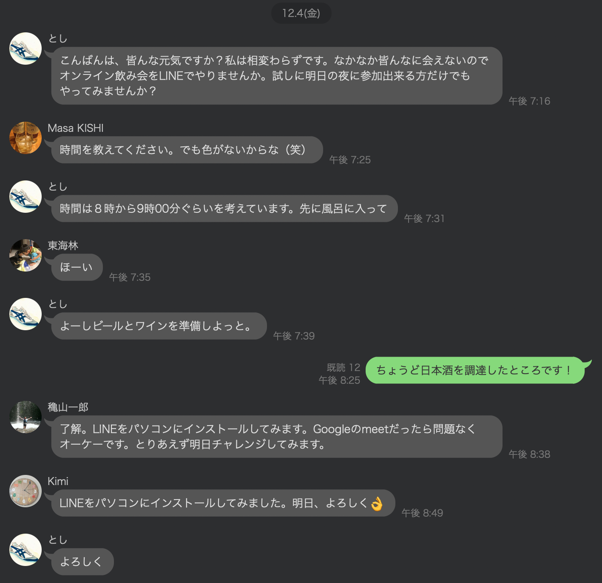
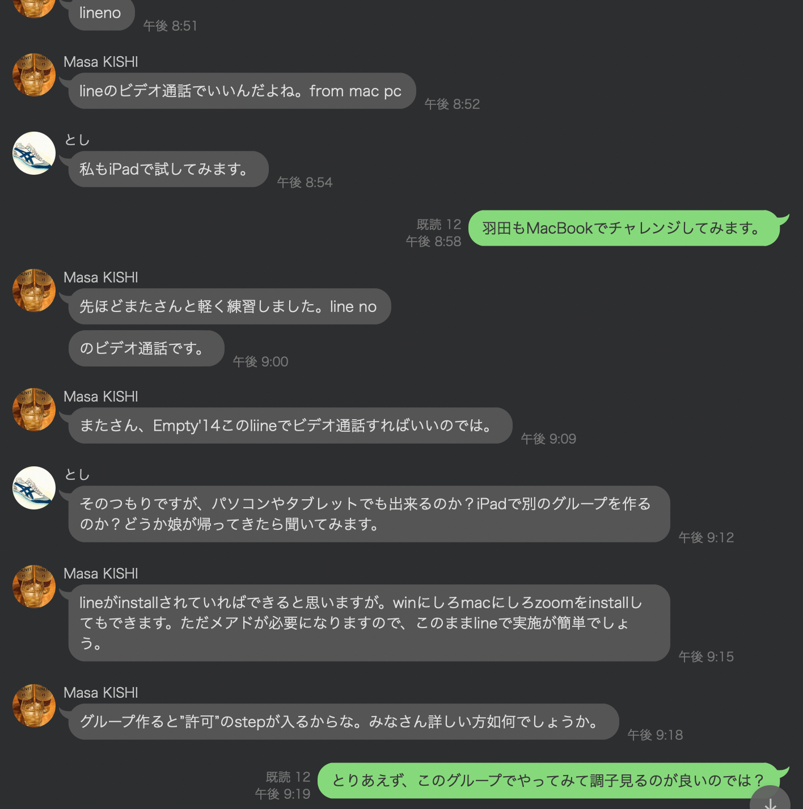
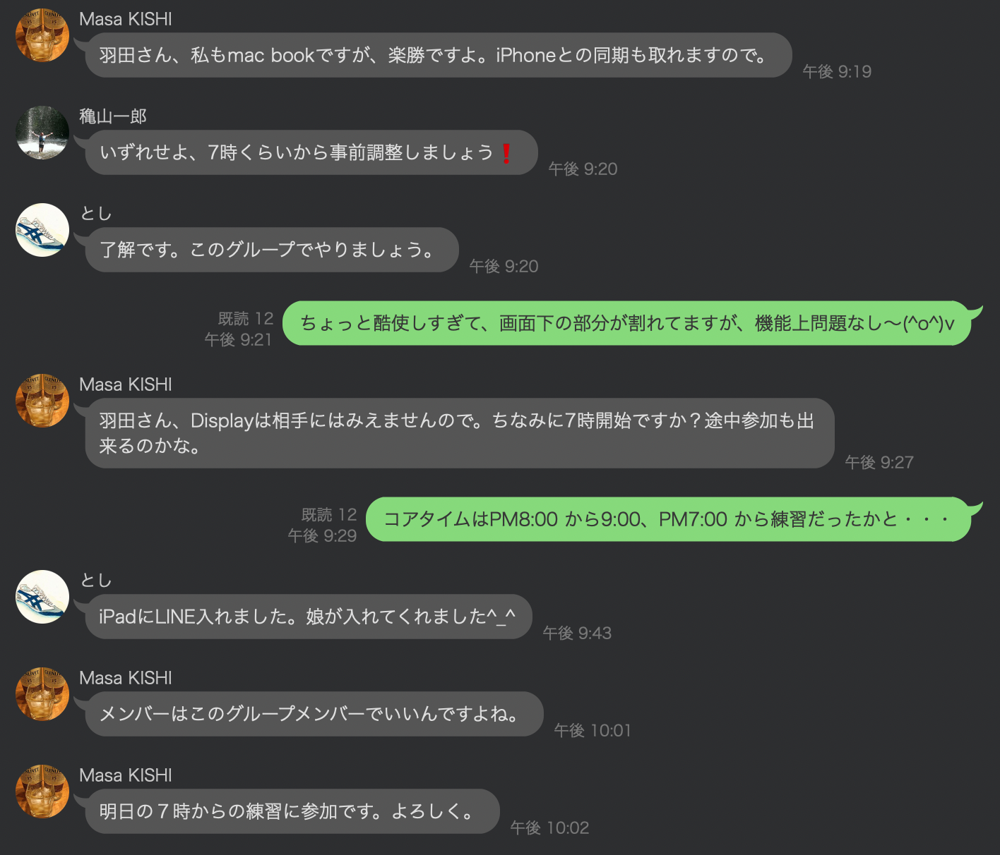
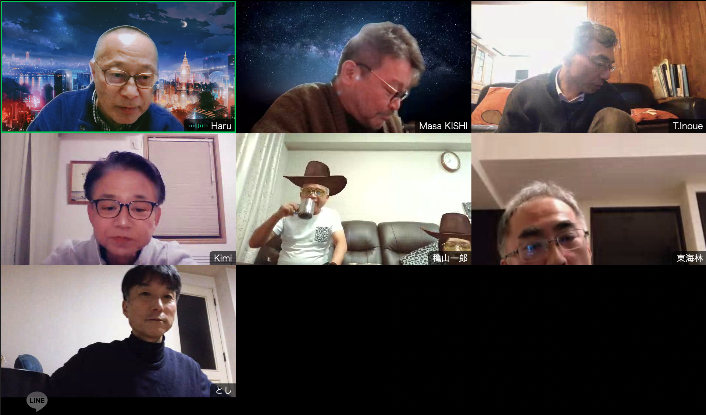
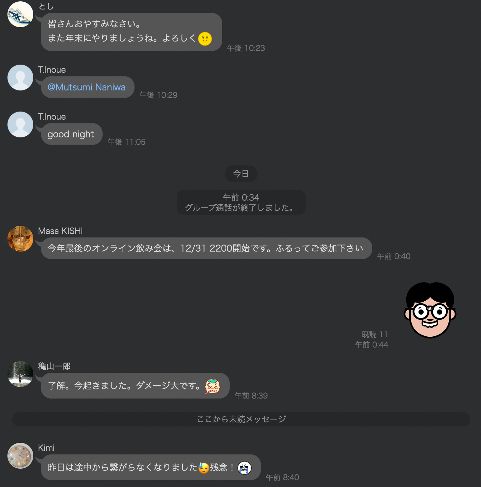
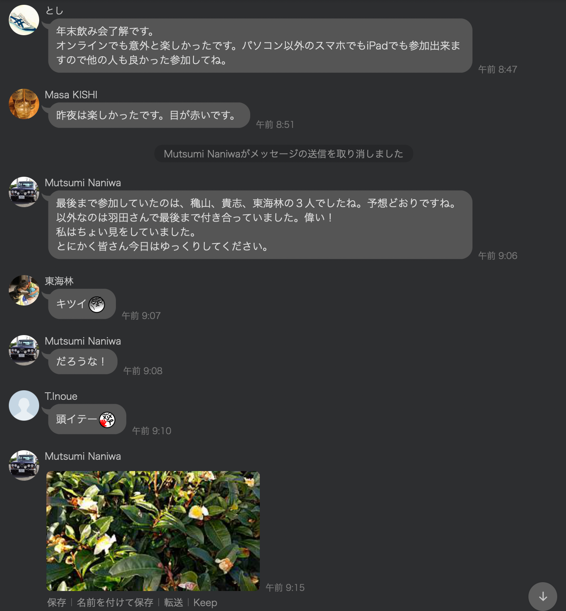
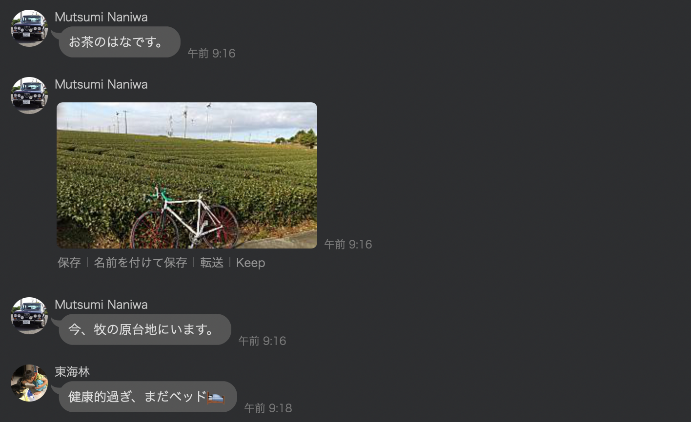

# Empty-s_LINE_3

<html lang="ja">
 <head>
  <meta charset="utf-8" />
 

<link href="https://cdnjs.cloudflare.com/ajax/libs/lightbox2/2.7.1/css/lightbox.css" rel="stylesheet">
   
</head>

  モバイル端末をお使いの場合は、画面を横向きにするとより見やすくご覧頂けます。

<body onload="alert('エンプティーズ と レプレッションズ、忘年会準備LINE会話の記録です！')" onunload="alert('再会の時まで、元気でお過ごしくださいませ。またやりましょう〜(^o^)/')">
<h1><marquee behavior="alternate">!!! Empty's & Lepression's !!!</marquee></h1>

<a href="https://torokoid.github.io/Empty-s/">忘年会</a>&gt;LINE会話

2019、河口湖忘年会

                              

 アクセス用QRコード

<marquee direction="right" scrollamount="20" width="30%">(^_^)/~hada</marquee>

	
	
<h2><marquee behavior="alternate">!!! 2020年12月5日、いつもの河口湖からLINE呑み会に変更!!!</marquee></h2>
	
<h3>↓ 画像はクリックで拡大、スライドショー表示します。</h3>
<section><h4>2020年12月04日 俣さんからOnLine飲み会の提案。 
以下、LINE会話</h4></section>

                              

  

 

<!-- フッタ -->
 <footer>
 Copyright 2020/12/06 S.Hada
 </footer>
